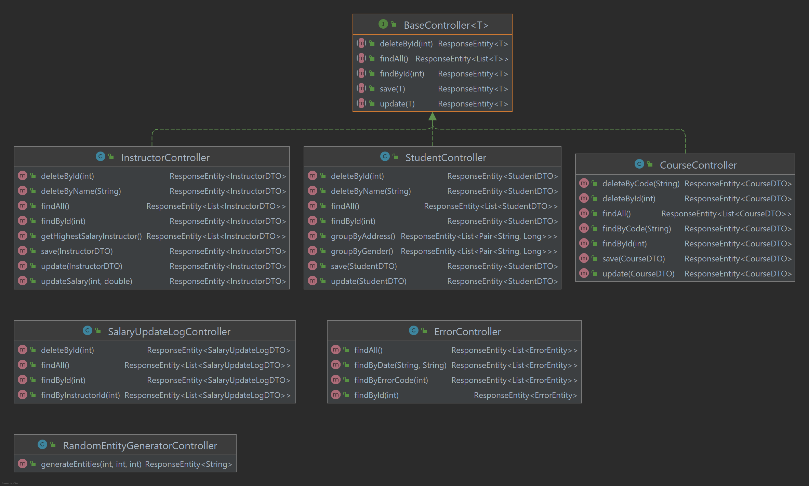

# School Management System

## Description
Fifth assigment of Gittigidiyor Spring Bootcamp

## Technologies
- Spring Boot
- Spring DATA JPA
- Swagger
- MapStruct
- Maven

Database: H2

```shell
$ git clone https://github.com/113-GittiGidiyor-Java-Spring-Bootcamp/fifth-homework-avemphract
$ cd fifth-homework-avemphract
$ mvn spring-boot:run
```

## Entities
Entity UML diagram


## Controllers
Controller UML diagram


### Course End Points
- GET http://localhost:8080/api/courses
- GET http://localhost:8080/api/courses/{id}
- GET http://localhost:8080/api/courses/course_code/{code}
- POST http://localhost:8080/api/courses
- PUT http://localhost:8080/api/courses
- DELETE http://localhost:8080/api/courses/{id}
- DELETE http://localhost:8080/api/courses/name/{code}

### Instructor End Points
- GET http://localhost:8080/api/instructor
- GET http://localhost:8080/api/instructor/{id}
- POST http://localhost:8080/api/~~~~instructor
- PUT http://localhost:8080/api/instructor
- PUT http://localhost:8080/api/instructor/{id}/salary
- DELETE http://localhost:8080/api/instructor/{id}
- GET http://localhost:8080/api/instructor/get_highest_salary

### Student End Points
- GET http://localhost:8080/api/students
- GET http://localhost:8080/api/students/{id}
- POST http://localhost:8080/api/students
- PUT http://localhost:8080/api/students
- DELETE http://localhost:8080/api/students/{id}
- DELETE http://localhost:8080/api/students/name/{name}
- GET http://localhost:8080/api/students/group_by_address
- GET http://localhost:8080/api/students/group_by_gender

### Error End Points
- GET http://localhost:8080/api/errors
- GET http://localhost:8080/api/errors/{id}
- GET http://localhost:8080/api/errors/code/{error_code}
- GET http://localhost:8080/api/code/error_date 

### Salary Update Log End Points
- GET http://localhost:8080/api/salary_update_logs
- GET http://localhost:8080/api/salary_update_logs/{id}
- GET http://localhost:8080/api/salary_update_logs/instructor_id/{id}
- DELETE http://localhost:8080/api/salary_update_logs/{id}

## Exceptions
Created exceptions handled with Global Exception Handler. Also created errors logs save in data base
- AbsentEntityException
- CourseIsAlreadyExistException
- InstructorIsAlreadyExistException
- StudentAgeNotValidException
- StudentNumberForOneCourseEception